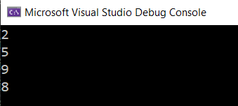

# py-in-cpp
Py-in-cpp is a collection of C++ functions that are built to match Python's built-in functions, string methods and list/dictionary methods.

Note: namespace std; is already implemented when you import pyincpp.h
```cpp 
using namespace std;
```


# Table of Contents
Built-in Functions
- [Sum()](#sum)
- [Print()](#print)
- [Len()](#len)

String Methods
- [Split()](#split)
- [Strip()](#Strip)
- [Replace()](#replace)
- [Lower()](#lower)
- [Upper()](#upper)
- [Capitalize()](#capitalize)
- [Count()](#count)

# Sum()
Summate all integers in your array at ease!
```cpp 
sum(num_in, element)
```
* num_in - The target array you would like to summate.
* element - The number of elements in your array.

#### Example

```cpp
#include <iostream>
#include "pyincpp.h"
int main()
{
    int num_1[] = {1, 2, 3, 4, 5, 6};
    cout << pyincpp::sum(num_1, 6) << endl;
    
    int num_2[] = {12, 44, 2};
    cout << pyincpp::sum(num_2, 3) << endl;
    
    int num_3[] = {5, 5, 5, 5, 5};
    cout << pyincpp::sum(num_3, 5) << endl;
}
```
#### Output


[Back to table of contents](#table-of-contents)

# Print()
A quicker way to print!
```cpp 
print(*args)
```
* args - Can be int, float, string or bool.

#### Example

```cpp
#include <iostream>
#include "pyincpp.h"
int main()
{
    bool a = false;
    int b = 100;
    string c = "hello world";
    float d = 3.12;
    pyincpp::print(a);
    pyincpp::print(b);
    pyincpp::print(c);
    pyincpp::print(d);
}
```
#### Output


[Back to table of contents](#table-of-contents)

# Len()
Returns the length of an object with types int and string.
```cpp 
len(object_length)
```
* object_length - Compute the length of characters in your given object.

#### Example

```cpp
#include <iostream>
#include "pyincpp.h"
int main()
{
	int num_1 = 12, num_2 = 12345;
	string str_1 = "How long?", str_2 = "Not Long";
	cout << pyincpp::len(num_1) << endl;
	cout << pyincpp::len(num_2) << endl;
	cout << pyincpp::len(str_1) << endl;
	cout << pyincpp::len(str_2) << endl;
}
```
#### Output



[Back to table of contents](#table-of-contents)

# Split()
This is the C++ version of Pythons split function! You can take a target string and split it into a list.
 
 ```cpp
split(str_in, str_search, element)
```
* str_in - The string you would like to split.
* str_search - Where you would like to split the string.
* element - Which element you would like to return.

#### Example

```cpp
#include <iostream>
#include "pyincpp.h"
int main()
{
    string str_1 = "Angel Davila";
    cout << pyincpp::split(str_1, " ", 1) << endl;
    
    string str_2 = "There are seven words in this sentence.";
    cout << pyincpp::split(str_2, " ", 2) << endl;
    
    string str_3 = "marley-EE#7068";
    cout << pyincpp::split(str_3, "#", 0) << endl;
}
```
#### Output


[Back to table of contents](#table-of-contents)

# Strip()
Python has this cool strip function that allows you to get rid of spacing in a string, now you can do it in C++.

```cpp 
strip(str_in)
```
* str_in - The string you would like to strip of white space.

*Note: currently takes away all white space, including spaces in the middle of a string. Working to mimic Python's actual function.

#### Example

```cpp
#include <iostream>
#include "pyincpp.h"
int main()
{
    string str_1 = "  Spaces will strip away   ";
    cout << pyincpp::strip(str_1) << "Finish" << endl;
    
    string str_2 = "1 2 3 4 5 6";
    cout << pyincpp::strip(str_2) << endl;
    
    string str_3 = "1.              Angel_Davila";
    cout << pyincpp::strip(str_3) << endl;
}
```
#### Output


[Back to table of contents](#table-of-contents)

# Replace()
Like Python's replace function, use can take a target string, locate an element and replace it with another.
```cpp 
replace(replace_str, element_1, element_2)
```
* replace_str - The target string you would like to modify.
* element_1 - The character or word you would like to replace in your string.
* element_2 - The new character or word you would like to use to replace.

#### Example

```cpp
#include <iostream>
#include "pyincpp.h"
int main()
{
    string str_1 = "His name is Angel he likes C++ and Python";
    cout << pyincpp::replace(str_1, "Angel", "Ben") << endl;
    
    string str_2 = "Replace all the ooooooooooooooooo's";
    cout << pyincpp::replace(str_2, "o", "G") << endl;
    
    string str_3 = "You can replace single letters or whole words anywhere!";
    cout << pyincpp::replace(str_3, "You", "Anyone") << endl;
}
```
#### Output


[Back to table of contents](#table-of-contents)

# Lower()
Just like Python's .lower(), you can use pyincpp's lower function to lower case all the characters in a string.
```cpp 
lower(tr_in)
```
* str_in - String that will be converted to all lower case.

#### Example

```cpp
#include <iostream>
#include "pyincpp.h"
int main()
{
	string str_1 = "His Name Is Angel And He Loves C++ and Python";
	cout << pyincpp::lower(str_1) << endl;

	string str_2 = "ALL LOWER PLEASE";
	cout << pyincpp::lower(str_2) << endl;

	string str_3 = "rAnDoM sTrInG wItH rAnDoM cAPs";
	cout << pyincpp::lower(str_3) << endl;
}
```
#### Output


[Back to table of contents](#table-of-contents)

# Upper()
Just like Python's .upper(), you can use pyincpp's upper function to upper case all the characters in a given string.
```cpp 
upper(str_in)
```
* str_in - String that will be converted to all upper case.

#### Example

```cpp
#include <iostream>
#include "pyincpp.h"
int main()
{
	string str_1 = "His Name Is Angel And He Loves C++ and Python";
	cout << pyincpp::upper(str_1) << endl;

	string str_2 = "all upper please";
	cout << pyincpp::upper(str_2) << endl;

	string str_3 = "rAnDoM sTrInG wItH rAnDoM cAPs";
	cout << pyincpp::upper(str_3) << endl;
}
```
#### Output


[Back to table of contents](#table-of-contents)

# Capitalize()
Capitalize the first character in your string!
```cpp 
capitalize(str_in)
```
* str_in - The given string that will have only its first element capitalized.

#### Example

```cpp
#include <iostream>
#include "pyincpp.h"
int main()
{
	string str_1 = "cap the c in cap";
	cout << pyincpp::capitalize(str_1) << endl;

	string str_2 = "gG";
	cout << pyincpp::capitalize(str_2) << endl;

	string str_3 = "his Name Is Angel And He Loves C++ and Python";
	pyincpp::print(pyincpp::capitalize(pyincpp::lower(str_3)));
}
```
#### Output


[Back to table of contents](#table-of-contents)

# Count()
Returns the number of times a specified value occurs in a string.
```cpp 
count(str_in, str_search)
```
* str_in - The string you would like to search through.
* str_search - The specified word you are looking for.

#### Example

```cpp
#include <iostream>
#include "pyincpp.h"
int main()
{
	string str_1 = "hello world, hello world, hello world";
	cout << pyincpp::count(str_1, "world") << endl;

	string str_2 = "Fear leads to anger; anger leads to hatred; \
					hatred leads to conflict; conflict leads to \
					suffering. \
					— Yoda, in Star Wars Episode I: The Phantom Menace.";
	cout << pyincpp::count(str_2, "conflict") << endl;

	string str_3 = "how much wood could a woodchuck chuck chuck if \
					a woodchuck could chuck wood";
	cout << pyincpp::count(str_3, "chuck") << endl;
}
```
#### Output


[Back to table of contents](#table-of-contents)


